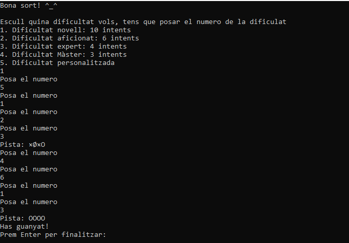
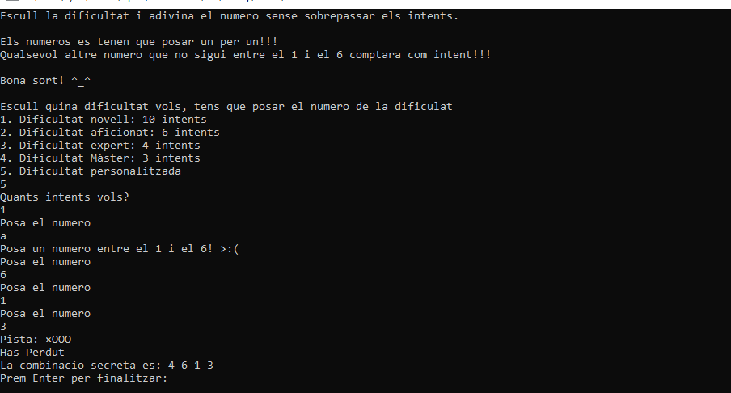
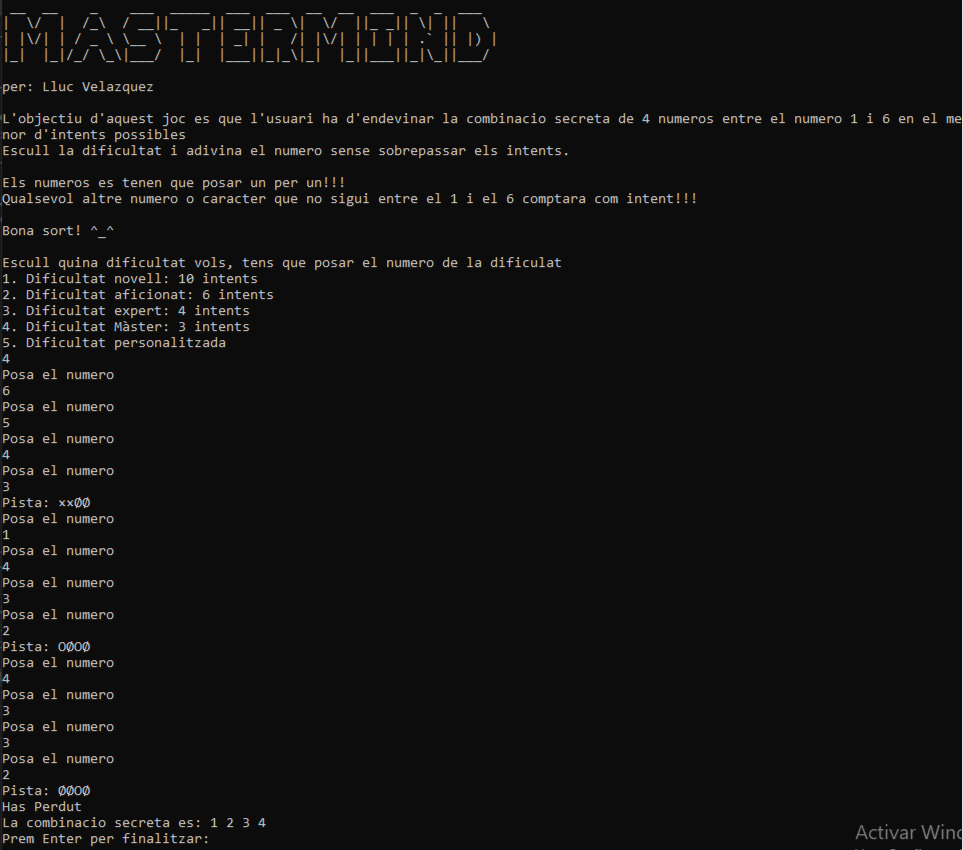
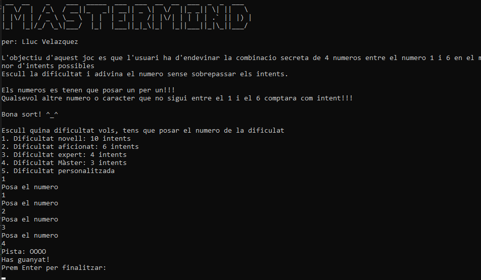
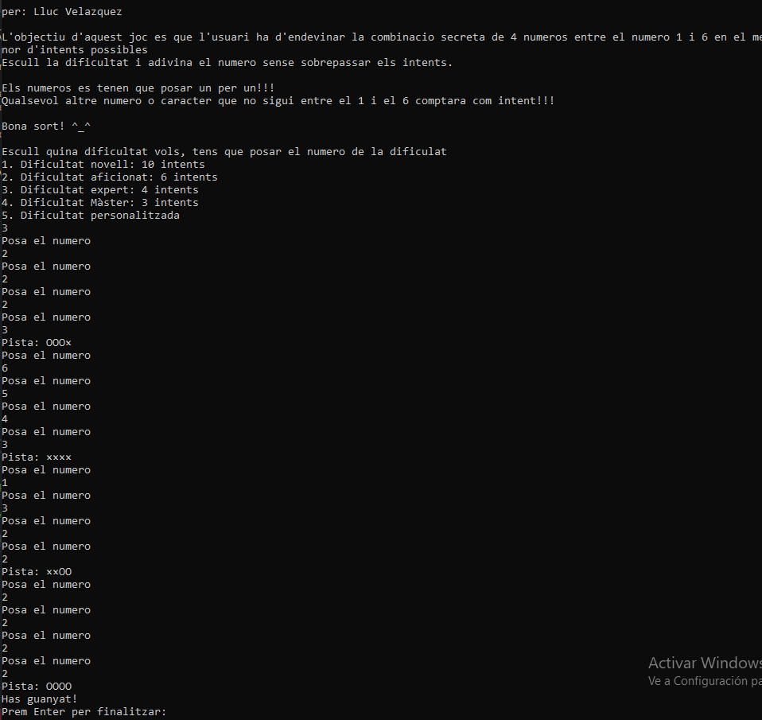
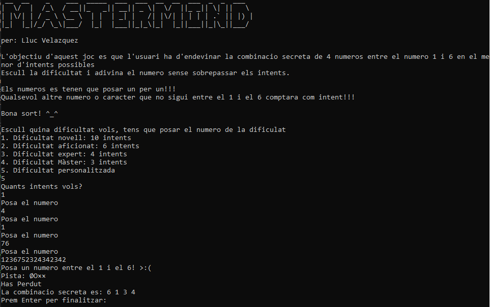
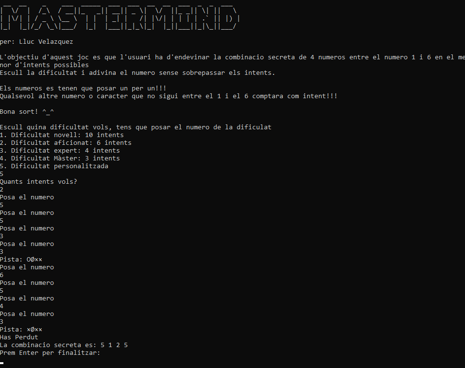
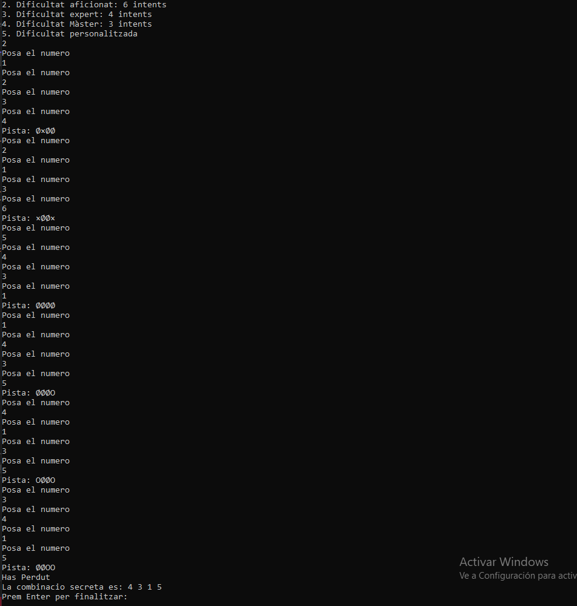

# MASTERMIND
per: Lluc Velázquez

## Robust

El meu programa s'executa sense problemes i fa el que demana, compleix amb el que demana.

## Claredat i ordre

L'estructura del programa costa una mica de seguir, pero les instruccions i els comentaris expliquen que fa cada cosa i ajuden a poder veure.

## Variables i constants

Els noms de les variables son prou autodescriptius i son en angles, tambe tenen comentaris per saber que fan cada integer.

## Estructures de control

Totes les condicions a les estructres son utilitzades, tampoc es fan servir sentencies com el break, en el unic cas que s'utilitza es en el switch.

## Gestió d'errors

Es controlen els possibles errors pero no al 100%, es controla que no posin caracters alfabetics pero si posen numeros que no toquen a l'hora de posar el teu resultat ho deixa pasar, ja que en el titol ja diu que tenen que ser del 1 al 6, i si poses altre comptara com intent.
Pero a l'hora de escollir dificlutat si que es obligatori posar entrre el 1 i el 5, sino , no et deixara continuar

## Disseny Modular

El disseny per a mi es correcte, encara que no he fet funcions perque tampoc repeteixo el codi.

## Jocs de proves

#### Joc de prova 1:

#### Joc de prova 2:

#### Joc de prova 3:

#### Joc de prova 4:

#### Joc de prova 5:

#### Joc de prova 6:

#### Joc de prova 7:

#### Joc de prova 8:

## UX/UI 

La interficie del joc es amigable els missatge d'interaccio son prou intuitius per permetre seguir el joc

